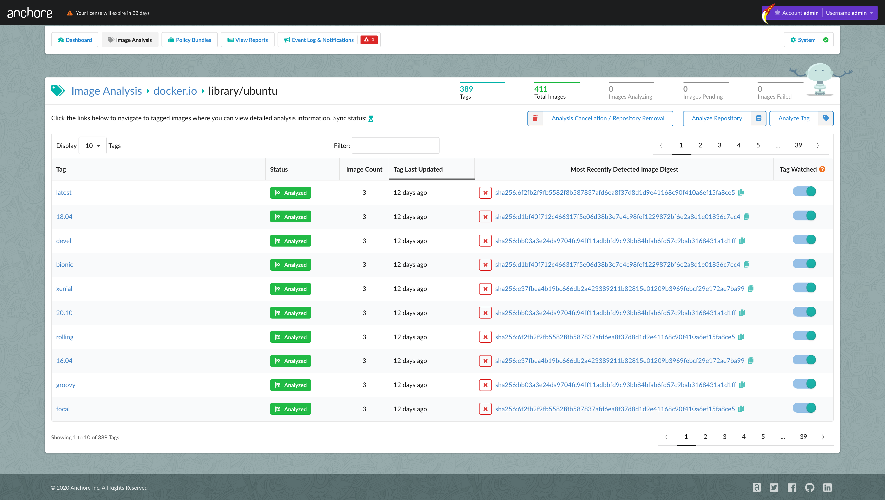

### Overview

In this section you will learn how to submit images for analysis using the user
interface, and how to execute a bulk removal of pending items or
previously-analyzed items from within a repository group.

**Note:** Only administrators and standard users with the requisite role-based
access control permissions are allowed to submit items for analysis, or remove
previously analyzed assets.

### Getting Started

From within an authenticated session, click the **Image Analysis** button on the
navigation bar:

You will be presented with the **Image Analysis** view. On the right-hand side
of this view you will see the **Analyze Repository** and **Analyze Tag** buttons:

These controls allow you to add _entire repositories_ or _individual items_ to
the Anchore Engine analysis queue, and to also provide details about how you
would like the analysis of these submissions to be handled on an ongoing basis.
Both options are described below in the following sections.

### Analyze a Repository

After clicking the **Analyze Repository** button, you are presented with the
following dialog:

The following fields are required:

- **Registry**—for example: `docker.io`
- **Repository**—for example: `library/centos`

Provided below these fields is the **Watch Tags in Repository** configuration
toggle. By default, when **One-Time Tag Analysis** is selected _all tags
currently present_ in the repository will be analyzed; once initial analysis is
complete the repository will _not_ be watched for future additions.

Setting the toggle to **Automatically Check for Updates to Tags** specifies that
the repository _will_ be monitored for any new tag additions that take place
_after_ the initial analysis is complete. Note that you are also able to set
this option for any submitted repository from within the **Image Analysis**
view. 

Once you have populated the required fields and click **OK**, you will be
notified of the overhead of submitting this repository by way of a count that
shows the _maximum_ number of tags detected within that repository that will be
analyzed:

You can either click **Cancel** to abandon the repository analysis request at
this point, or click **OK** to proceed, whereupon the specified repository will
be flagged for analysis.

### Analyze a Tag

After clicking the **Analyze Tag** button, you are presented with the
following dialog:

The following fields are required:

- **Registry**—for example, `docker.io`
- **Repository**—for example, `library/centos`
- **Tag**—for example, `latest`

**Note:** Depending upon where the dialog was invoked, the above fields may be
pre-populated. For example, if you clicked the **Analyze Tag** button while
looking at a view under **Image Analysis** that describes a previously-analyzed
repository, the name of that repository and its associated registry will be
displayed in those fields.

Some additional options are provided on the right-hand side of the dialog:

- **Watch Tag**—enabling this toggle specifies that the tag should be
monitored for image updates on an ongoing basis after the initial analysis

- **Force Reanalysis**—if the specified tag has already been analyzed, you can
force re-analysis by enabling this option. You may want to force re-analysis if
you decide to add annotations (see below) after the initial analysis. This
option is ignored if the tag has not yet been analyzed.

- **Add Annotation**—annotations are optional key-pair values that can be 
added to the image metadata. They are visible within the **Overview** tab of
the **Image Analysis** view once the image has been analyzed, as well as from
within the payload of any webhook notification from Anchore Engine that contains
image information.

Once you have populated the required fields and click **OK**, the specified tag
will be scheduled for analysis. 

**Note:** Anchore Engine will attempt to download images from any registry
without requiring further configuration. However, if your registry needs
authentication then the corresponding credentials will need to be defined. See
[Configuring Registries]() for more
information.

### Repository Deletion

Shown below is an example of a repository view under **Image Analysis**:

From a repository view you can carry out actions relating to the bulk removal of
items in that repository. The **Analysis Cancellation / Repository Removal**
control is provided in this view, adjacent to the analysis controls:

After clicking this button you are presented with the following options:

- **Cancel Images Currently Pending Analysis**—this option is only enabled if
you have one or more tags in the repository view that are currently scheduled
for analysis. When invoked, all pending items will be removed from the queue.
This option is particularly useful if you have selected a repository for
analysis that contains many tags, and the overall analysis operation is
taking longer than initially expected.
 
  **Note:** If there is at least _one_ item present in the repository that is
 _not_ pending analysis, you will be offered the opportunity to decide if you
 want the repository to be watched after this operation is complete.

- **Remove Repository and Analyzed Items**—In order to remove a repository from
the repository view in its entirety, _all_ items currently present within the
repository must first be removed from Anchore Engine. When invoked, all items
(in any state of analysis) will be removed. If the repository is being watched,
this subscription is also removed.